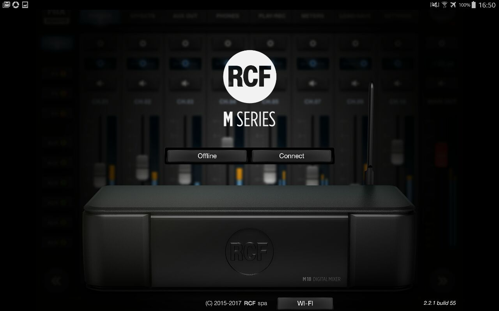

## MixRemote 

  

Come precedentemente detto questa è l'applicativo usato per il controllo remoto del mixer posto in sala.

1. **Download MixRemote**: 
   - Per dispositivi Android: Scarica l'app MixRemote dal [Google Play Store](https://play.google.com/store/apps/details?id=com.rcf.mixremote&hl=it&gl=US).
   - Per dispositivi iOS: Scarica l'app MixRemote dall'[App Store](https://apps.apple.com/it/app/mixremote/id1053268034).

2. **Avvia MixRemote**: 
   - Una volta completato il download, individua l'icona dell'app MixRemote sul tuo dispositivo e avviala.

3. **Connettiti all'access point del mixer**: 
   - Assicurati che il tuo dispositivo sia connesso alla stessa rete Wi-Fi o Ethernet del mixer digitale RCF.
   - Apri le impostazioni Wi-Fi o Ethernet del tuo dispositivo e connettiti all'access point del mixer. Puoi trovare le informazioni sull'access point nel manuale o nelle specifiche del tuo mixer.

4. **Avvia MixRemote**: 
   - Tocca sull'icona dell'app MixRemote per avviarla sul tuo dispositivo.

1. **Clicca su "Connect"**: 
   - Una volta avviata l'app MixRemote, verrà visualizzata la schermata di connessione.
   - Tocca sul pulsante "Connect" per avviare la ricerca dei dispositivi mixer nella rete.

1. **Seleziona il tuo mixer**: 
   - Dopo aver avviato la ricerca, MixRemote mostrerà un elenco dei mixer digitali disponibili nella rete.
   - Seleziona il tuo mixer dalla lista dei dispositivi disponibili.

2. **Connessione al mixer**: 
   - MixRemote cercherà di stabilire una connessione al tuo mixer digitale.
   - Una volta stabilita la connessione, sarai pronto per iniziare a controllare il tuo mixer tramite l'app MixRemote.

:::tip
Ora sei pronto per utilizzare MixRemote per il controllo remoto del tuo mixer digitale RCF. Assicurati di consultare il manuale del mixer e la documentazione dell'app MixRemote per sfruttarne al meglio tutte le funzionalità.
:::