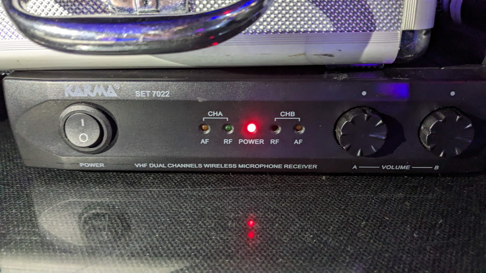

# Microfoni

## Microfoni Disponibili
I microfoni connessi al mixer sono molteplici. Si troveranno due macro tipologie:
- Microfoni wireless; 
- Microfoni connessi via cavo; 

I primi sono usati per qualsiasi oratore in movimento mentre i secondi sono prevalentamente fissi sul palco ed utilizzati dai musicisti.

Di seguito saranno illustrati i ricetrasmettitori dei microfoni wireless connessi al mixer e dei quali è necessario assicurarsi che siano regolarmente accesi dai relativi tasti di accensione. 
Quelli disponibili e connessi al mixer sono 3 ed elencati qui di seguito con relativa immagine:
### Annunci e speaker secondari

Ricetrasmettitore relativo al microfono che come vedrete nella sezione dedicata alla [scena principale](./Scena%20Principale.md) è denominato **Singer Wireless** ma che più in generale viene sempre usato come microfono per uso generico.

---
### Microfono Shure

Ricetrasmettitore relativo al microfono personale del pastore Sergio che viene prevalentemente usato da lui in circostanze di interventi generali.

---
### Microfono Archetto

Ricetrasmettitore relativo all'archetto microfonico usato del pastore Sergio durante la sua ministrazione del messaggio. 

