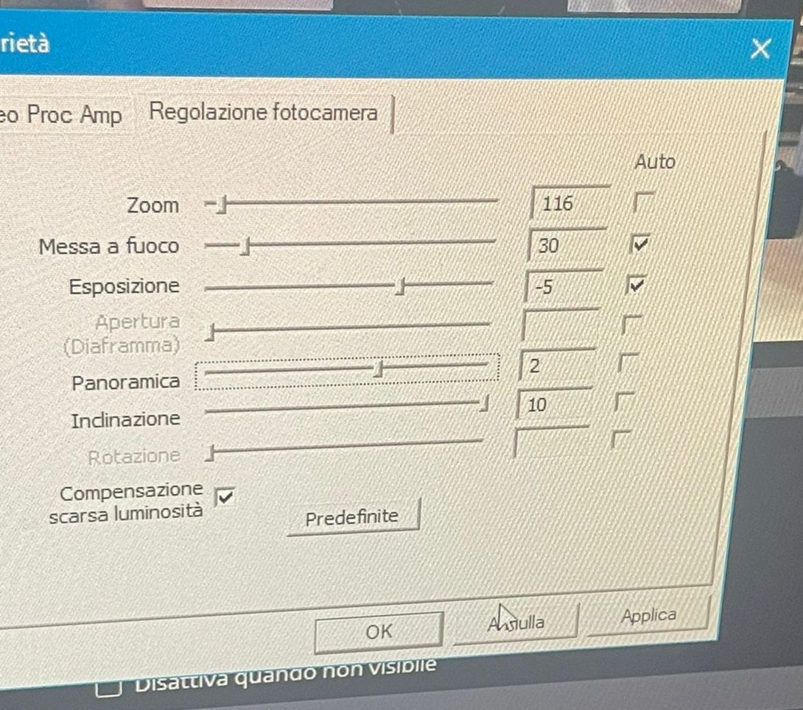
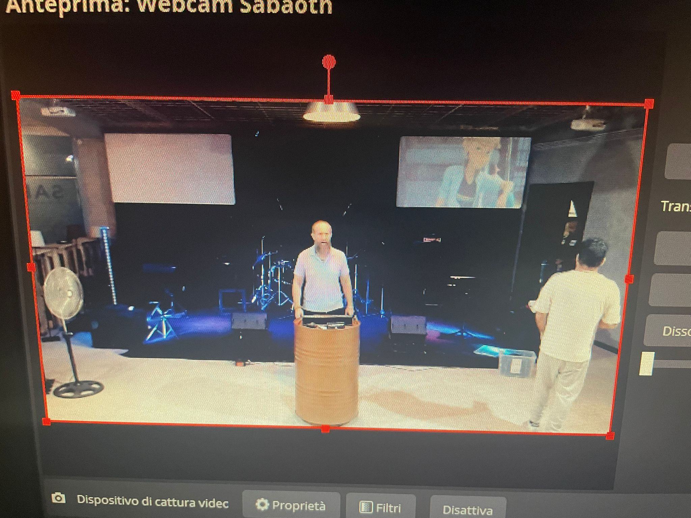

# Impostazioni Video Webcam

## Valori
:::info
#### Qui di seguito sono riportate le impostazioni da dover settare nella webcam prima della registrazione con OBS.
:::
<bp/>

<bp/>

## Anteprima
:::warning
#### L'anteprima visiva che dovrebbe venirne fuori deve essere più o meno la seguente:
Se così non fosse, controllare che non abbia fisicamente la webcam delle insolite inclinazioni.
:::
<bp/>

